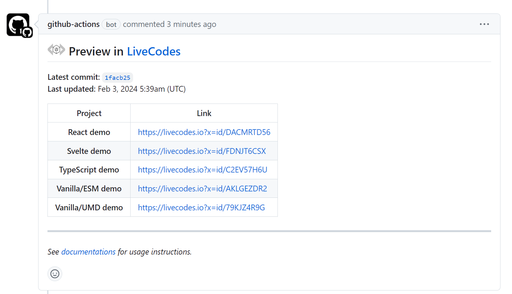

# Preview in LiveCodes

This is a GitHub action that generates preview links to [LiveCodes playground](https://livecodes.io) for code changes in pull requests and posts them as pull request comments.

This can be useful for library authors to preview changes in the playground before merging the pull request.



PLease check the [example repo](https://github.com/hatemhosny/preview-in-livecodes-demo) for a working demo.

## Inputs

- `install-command` (Optional): Install command (e.g. `npm install`)
- `build-command` (Optional): Build command (e.g. `npm run build`)
- `base-url` (Optional): Base URL used to link to deployed files using the pattern: `{{LC::TO_URL(./file.js)}}`
- `artifact` (Optional): Artifact name used to save the message (default: `pr`)
- `GITHUB_TOKEN`: Github token of the repository (default: `${{ github.token }}` - automatically created by Github)

## Outputs

- `message`: The MarkDown message with preview links (e.g. to post as comment in the PR)

## Usage

This action generates the message for the PR comment and uploads it as an artifact. It can be used in conjunction with the action [`live-codes/pr-comment-from-artifact`](https://github.com/live-codes/pr-comment-from-artifact) which posts the message in artifact as a comment in the PR. Two different actions are used because each runs in a different context and requires different permissions. See [this article](https://securitylab.github.com/research/github-actions-preventing-pwn-requests/) for more details.

This is an example for usage:

- This is a demo function to run in the playground:

**index.js**

```js
export const demo = () => {
  console.log("Hello, World!");
};
```

- This is a JSON file for a LiveCodes project in the `.livecodes` folder. It can be either a project [configuration object](https://livecodes.io/docs/configuration/configuration-object) or a playground [embed object](https://livecodes.io/docs/sdk/js-ts#createplayground):

**.livecodes/hello-world.json**

```json
{
  "title": "JavaScript Starter",
  "markup": {
    "language": "html",
    "content": "<h1>Hello, World!</h1>"
  },
  "script": {
    "language": "javascript",
    "content": "import { demo } from './index.js';\n\ndemo();"
  },
  "imports": {
    "./index.js": "{{LC::TO_DATA_URL(./index.js)}}"
  }
}
```

Multiple playgrounds can be created by adding multiple JSON files in the same `.livecodes` folder. The [`title`](https://livecodes.io/docs/configuration/configuration-object#title) property of the [configuration object](https://livecodes.io/docs/configuration/configuration-object) is used as the playground name in the message, otherwise the filename is used.

Note the use of `{{LC::TO_DATA_URL(./index.js)}}` in the [imports](https://livecodes.io/docs/features/module-resolution#custom-module-resolution) property. The file `index.js` is converted to a [data URL](https://developer.mozilla.org/en-US/docs/Web/HTTP/Basics_of_HTTP/Data_URIs) and imported in the playground. See later for more details and other options.

- Trigger the action when a pull request is created or updated:

**.github/workflows/livecodes-preview.yml**

```yaml
name: livecodes

on: [pull_request]

jobs:
  build_and_prepare:
    runs-on: ubuntu-latest
    name: Generate Playgrounds
    steps:
      - name: Checkout
        uses: actions/checkout@v3

      - name: Build and generate
        uses: live-codes/preview-in-livecodes@v1
        with:
          # install-command: "npm install"
          # build-command: "npm run build"
          # base-url: "https://{{LC::REF}}.my-project.pages.dev"
```

When new pull requests are created or updated, the action will run. It can optionally install dependencies and build the project. Then it looks for LiveCodes projects in the directory `.livecodes` and generates playgrounds for each and adds their links to the message. The generated message is saved as an artifact.

- Then the following action, which is triggered by the successful previous workflow, downloads the artifact and posts it as a comment in the pull request, using the available permissions:

**.github/workflows/livecodes-post-comment.yml**

```yaml
name: comment

on:
  workflow_run:
    workflows: ["livecodes"] # the workflow that created the artifact
    types:
      - completed

jobs:
  upload:
    runs-on: ubuntu-latest
    permissions:
      pull-requests: write
    if: >
      github.event.workflow_run.event == 'pull_request' &&
      github.event.workflow_run.conclusion == 'success'

    steps:
      - uses: live-codes/pr-comment-from-artifact@v1
        with:
          GITHUB_TOKEN: ${{ github.token }}
```

## Using Newly Added Code in Playgrounds

The new code added by the PR needs to be available as assets for the playgrounds (e.g. scripts, stylesheets, etc.).

The action allows installing dependencies and building the project, using the `install-command` and `build-command` inputs.

To use the files in the playgrounds, the available options include:

- You already deploy the project to a preview URL using a service like [Cloudflare Pages](https://pages.cloudflare.com/), [Netlify](https://www.netlify.com/) or [Vercel](https://vercel.com/). Then you can link to the deployed assets in the playgrounds. Add the base URL that points to the deployment as the action `base-url` input. This input can include [dynamic values](#dynamic-values) (e.g. `base-url: "https://{{LC::REF}}.my-project.pages.dev"`). Then in the project JSON, you can refer to the deployed assets like this: `{{LC::TO_URL(./file.js)}}`.

- The assets used in playgrounds are (pre-built and) committed in the pull request. You can refer to them using CDNs that mirror GitHub like [jsDelivr](https://www.jsdelivr.com/) (e.g. `https://cdn.jsdelivr.net/gh/my-username/my-repo@new-branch/file.js`).  
  You may also use the `base-url` input with dynamic values like `{{LC::SHA}}`, `{{LC::REF}}` or `{{LC::REPO}}` (e.g. `base-url: "https://cdn.jsdelivr.net/gh/{{LC::REPO}}@{{LC::SHA}}/"`), and refer to the assets as `{{LC::TO_URL(./file.js)}}`.

- The action can encode the files as [data URLs](https://developer.mozilla.org/en-US/docs/Web/HTTP/Basics_of_HTTP/Data_URIs) automatically when referred to in the playground. In the project JSON, you can refer to the encoded assets like this: `{{LC::TO_DATA_URL(./file.js)}}`. It is recommended to use this option only when the files are small. The project JSON (including the assets encoded as data URLs) is stored at [dpaste](https://dpaste.com/) (which has a maximum character limit of **1,000,000 characters** and the link expires after **365 days**).

## Dynamic Values

The following values are made available in the project JSON and in `base-url` input:

- `{{LC::REF}}`: The name of the branch or tag of the pull request head.
- `{{LC::SHA}}`: The full SHA of the commit.
- `{{LC::REPO}}`: The name of the repository.

In addition, in project JSON, you can use the following to refer to files in the repository:

- `{{LC::TO_URL(./file.js)}}`: The URL of the file `./file.js` with the `base-url` value prepended. The input `base-url` is required in this case.
- `{{LC::TO_DATA_URL(./file.js)}}`: Converts the file `./file.js` to a [data URL](https://developer.mozilla.org/en-US/docs/Web/HTTP/Basics_of_HTTP/Data_URIs) and uses it.

The file path is relative to the repository root.

## License

MIT License
